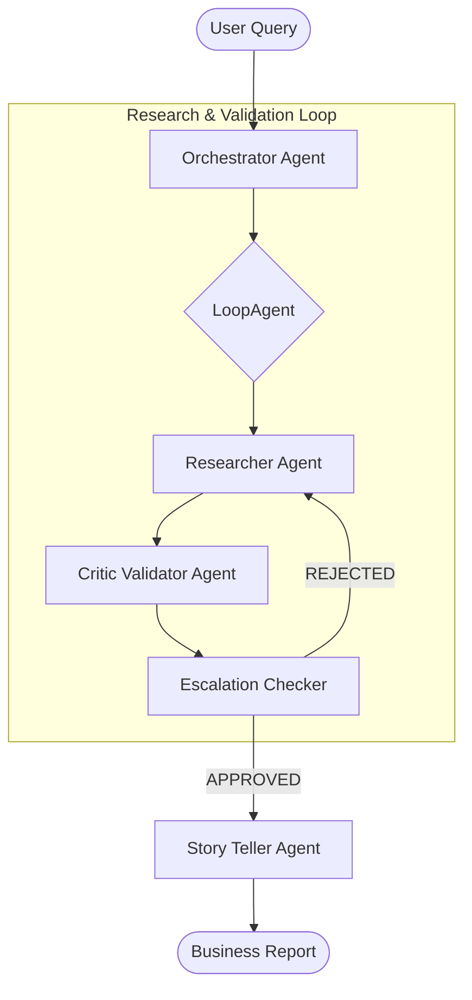

# SAP Analyst MVP — Google ADK Multi-Agent System

An AI-powered SAP procurement analyst built with the **Google Agent Development Kit (ADK)** and **Vertex AI (Gemini 2.0 Flash)**. This system implements a sophisticated multi-agent pipeline to autonomously query SAP tables, validate data, and deliver business-ready supply chain insights through a natural language interface.

> This MVP serves as a proof-of-concept for the Master Thesis topic: **"Autonomous Generation of Multi-Agent Systems for Supply Chain Planning"** at SAP's Supply Chain Management (SCM) Data Science team.

---

## 🏗 Architecture & Agentic Workflow

The system utilizes a hybrid **Agent-to-Agent (A2A)** architecture, where specialized agents communicate via the A2A protocol. Each agent operates as an independent microservice.

### Workflow Diagram



### Core Components

1.  **Orchestrator (Port 8000):** Manages the high-level research loop and delegates tasks to specialized sub-agents.
2.  **Researcher (Port 8001):** Equipped with SAP-specific tools to discover table schemas and extract data from the mock SAP environment.
3.  **Critic Validator (Port 8002):** A strict data governance auditor that evaluates data for logical flaws and business logic sanity.
4.  **Story Teller (Port 8003):** The final stage; translates raw JSON data into a professional, scannable business narrative.

---

## 🚀 Running the System

### Local Development (Multi-Process Simulation)
We simulate a microservices architecture by running each agent as a separate service on different ports.

1. **Prerequisites**:
   - Python 3.11+
   - `gcloud` CLI authenticated: `gcloud auth application-default login`

2. **Setup**:
   ```bash
   python3 -m venv .venv
   source .venv/bin/activate
   pip install -r requirements.txt
   ```

3. **Configure Environment (`.env`)**:
   ```env
   GOOGLE_GENAI_USE_VERTEXAI="true"
   GOOGLE_CLOUD_PROJECT="multiagent-system-496514"
   GOOGLE_CLOUD_LOCATION="global"
   ```

4. **Run the Full System**:
   ```bash
   chmod +x run_local.sh
   ./run_local.sh
   ```
   This script starts 4 independent processes on ports 8000–8003. Access the **ADK Dev UI** at: [http://localhost:8000](http://localhost:8000).

---

## 🛠 Project Structure

```text
SAP MVP/
├── .env                              # GCP configuration
├── requirements.txt                  # Project dependencies
├── run_local.sh                      # Local multi-process launch script
├── sap_analyst_sessions.db           # Persistent memory
└── sap_analyst/
    ├── orchestrator/                 # Root orchestrator & A2A config
    ├── Researcher/                   # SAP data tools & extraction logic
    ├── critic_validator/             # Data governance & auditing
    └── Story_teller/                 # Narrative generation
```

---

## 💾 Mock SAP Schema
The system uses in-memory dictionaries to mimic SAP HANA:
- **EKKO:** Purchasing Document Header
- **EKPO:** Purchasing Document Item
- **MARA:** General Material Data
- **MARD:** Storage Location Data

---

## 🎓 Thesis Context
This project addresses research in **Autonomous Multi-Agent Systems (MAS)**:
- **Autonomous Schema Navigation:** Agents discover relationships dynamically.
- **Data Governance:** Automated auditing via the Critic Validator.
- **Narrative Abstraction:** LLM-driven conversion of raw ERP data into business insights.
